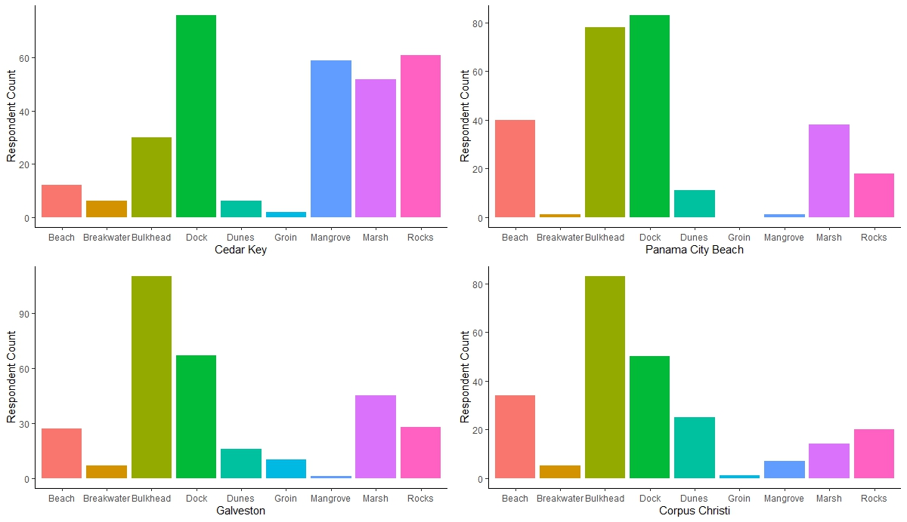

Results will be compiled here.

```{r ShorelinebySiteImage, echo = FALSE, message=FALSE, fig.align='center', fig.cap='Fig. 1. Shoreline characteristics by study site.', out.width='100%', fig.pos='H'}
library(tidyverse)

```

```{r echo=FALSE, warning=FALSE, message=FALSE}
# https://rstudio.github.io/leaflet/
# https://rstudio.github.io/leaflet/map_widget.html
# install.packages("leaflet")
library(leaflet)
m <- leaflet() %>%
  addTiles() %>%
  setView(lng = -90.254, lat = 28.572, zoom = 5)
  # addMarkers(lng = 174.768, lat = -36.852, popup = "The birthplace of R")
m
```

